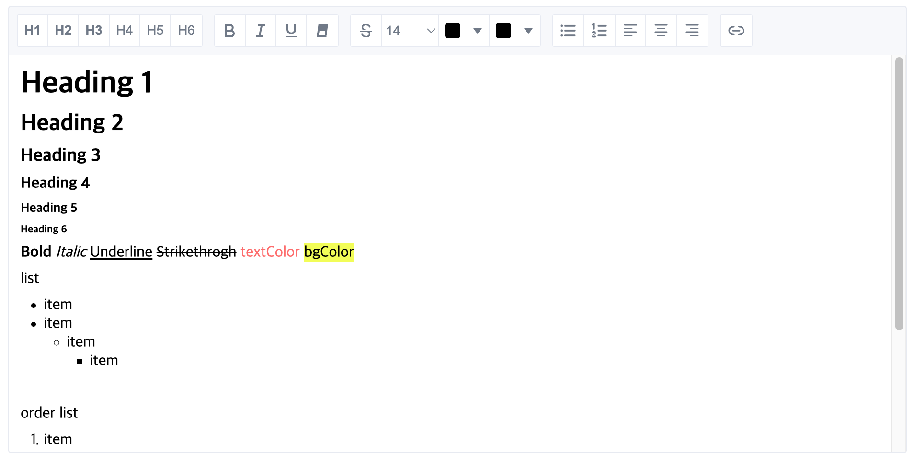

<p align="center">
  <a href="https://github.com/livemehere/fewings">
    
  </a>
  <h1 align="center">@fewings/text-editor</h1>      
  <p align="center">
  웹을 위한 WYSIWYG 에디터입니다.
  <br/>
  `React` 를 기본적으로 지원하고 있고, `core` 기능을 직접 활용하여 프레임워크에 국한되지 않고 다양한 환경에서 사용할 수 있습니다.
  </p>
  <p align="center">
    <a href="https://livemehere.github.io/fewings/?path=/story/text-editor-sample--default">Demo</a>
     &middot;
    <a href="https://www.npmjs.com/package/@fewings/text-editor">npm</a>
    &middot;
    <a href="https://github.com/livemehere/fewings/blob/master/packages/text-editor/README.md">English</a>
  </p>
</>



## Motivation

텍스트 에디터는 이미 훌륭한 라이브러리들이 다수 존재합니다.
하지만 대부분은 완성형에 가까워, 원하는 기능을 추가하거나 제거하고, 디자인을 수정하려면 내부 구조를 깊이 파악해야 하는 번거로움이 따릅니다.

@fewings/text-editor는 이러한 불편함을 해소하기 위해 핵심 기능만을 API 형태로 제공합니다.
사용자는 필요한 기능만 골라서 구현하고, 완전히 자유로운 방식으로 UI를 구성할 수 있습니다.

기본적인 스타일조차 포함되어 있지 않으며, 정의된 DOM 구조와 data-attributes, class 속성을 기반으로 직접 디자인을 구성해야 합니다.
또한, 이를 지원하기 위해 설계된 Selection, Range 관련 API를 함께 제공합니다.

> 🙏 모든 기능에 대한 설명을 포함하지 않습니다. 핵심 기능을 소개하며, 충분히 파악할 수 있는 낮은 추상화와 복잡도를 가지고 있습니다. `src/__test__`, `src/core` 와 [샘플코드](https://github.com/livemehere/fewings/tree/master/examples/stories/textEditor/sample) 를 참조해주세요.

## Installation

```bash
pnpm add @fewings/text-editor
```

## Getting Started

### 1. TextEditor 인스턴스 생성하기

텍스트 에디터는 DOM 기반으로 동작합니다. 먼저 에디터가 렌더링될 HTML 요소를 준비합니다.

```html
<div id="editor-container"></div>
```

```javascript
import { TextEditor } from "@fewings/text-editor";

// 에디터 컨테이너 요소 가져오기
const editorElement = document.getElementById("editor-container");

// TextEditor 인스턴스 생성
const editor = new TextEditor({
  element: editorElement,
  initialHtml:
    "<div data-block-id='w1u2oultf'>안녕하세요, 이것은 텍스트 에디터입니다.</div>", // 초기 HTML 내용 ⚠️ 앞서 언급한 DOM 구조를 준수해야 합니다 (직계 요소는 data-block-id 를 가진 HTMLDivElement 이어야 합니다)
  mode: "edit", // 'edit' 또는 'view' 모드 지정
  spellcheck: true, // 맞춤법 검사 활성화 여부
});
```

### 2. 이벤트 리스닝하기

TextEditor는 몇몇 핵심 이벤트를 제공합니다.(추가 예정)

```javascript
// 커서 위치 변경 이벤트
editor.on("cursorChanged", (cursorStatus) => {
  console.log("현재 커서 상태:", cursorStatus);

  // cursorStatus 객체는 현재 선택된 텍스트의 스타일 정보를 포함합니다:
  // isH1, isBold, isItalic, color, bgColor 등

  // 이 정보를 사용하여 툴바의 활성 상태를 업데이트할 수 있습니다
});

// HTML 내용 변경 이벤트
editor.on("onChange", (html) => {
  console.log("에디터 내용 변경:", html);

  // 변경된 HTML을 저장하거나 다른 처리를 할 수 있습니다
});

// 블록 추가 이벤트 (새로운 라인이 추가될 때 마다 발생)
editor.on("blockAdded", (blockElement) => {
  console.log("새 블록 추가됨:", blockElement);
});
```

### 3. 스타일링 액션 적용하기

다양한 텍스트 스타일링과 포맷팅 액션을 적용할 수 있습니다.

```javascript
// 볼드체 적용
document.getElementById("bold-button").addEventListener("click", () => {
  editor.action("bold");
});

// 이탤릭체 적용
document.getElementById("italic-button").addEventListener("click", () => {
  editor.action("italic");
});

// 제목 스타일 적용
document.getElementById("h1-button").addEventListener("click", () => {
  editor.action("heading", "h1");
});

// 텍스트 색상 변경
document.getElementById("color-picker").addEventListener("change", (e) => {
  editor.action("color", e.target.value);
});

// 링크 삽입
document.getElementById("link-button").addEventListener("click", () => {
  const url = prompt("URL을 입력하세요");
  if (url) {
    editor.action("link", url);
  }
});
```

### 4. React 에서 더 쉽게 사용하기

React 어플리케이션에서는 제공되는 컴포넌트와 훅을 활용하여 더 쉽게 에디터를 사용할 수 있습니다.

```tsx
import { useState } from "react";
import {
  TextEditorBody,
  TextEditorProvider,
  TextEditorView,
} from "@fewings/text-editor";

const initialHtml =
  "<div data-block-id='w1u2oultf'>안녕하세요, 이것은 텍스트 에디터입니다.</div>";

interface Props {
  mode?: "edit" | "view";
  spellcheck?: boolean;
  showPreview?: boolean;
}

export default function SampleTextEditor({
  mode,
  spellcheck,
  showPreview,
}: Props) {
  const [preview, setPreview] = useState(initialHtml);
  return (
    <div>
      <TextEditorProvider
        onChange={setPreview}
        initialHtml={initialHtml}
        mode={mode}
        spellcheck={spellcheck}
      >
        <div className="editor_layout">
          <TextEditorBody style={{ height: 400, overflowY: "scroll" }} />
        </div>
      </TextEditorProvider>
      {showPreview && <TextEditorView html={preview} className="preview" />}
    </div>
  );
}
```

### 5. 에디터 HTML 내용 가져오기 및 설정하기

```javascript
// 현재 에디터 내용을 HTML 문자열로 가져오기
const html = editor.toHtml();

// 에디터 내용 설정하기
editor.setHtml("<p>새로운 내용입니다.</p>");

// 에디터 모드 변경 (편집/읽기 전용)
editor.setMode("view"); // 읽기 전용으로 변경
editor.setMode("edit"); // 편집 가능하도록 변경
```

### 6. 에디터 정리하기

사용이 끝난 후에는 이벤트 리스너와 자원을 정리합니다.

> `<TextEditorProvider>` 를 사용한 경우, 내부적으로 정리됩니다.

```javascript
// 에디터 인스턴스 정리
editor.destroy();
```

## 기여하기

기여는 언제나 환영합니다! 제안, 버그 신고 또는 기능 요청이 있으시면 [GitHub 저장소](https://github.com/livemehere/fewings)에 이슈를 열거나 풀 리퀘스트를 제출해주세요.
